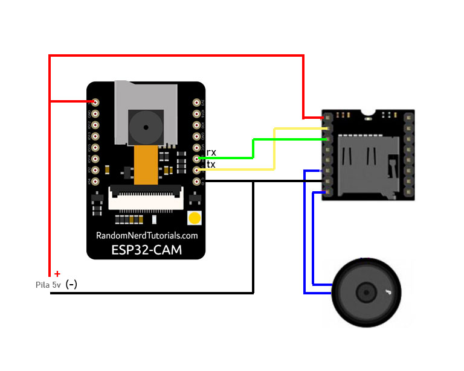

# PROYECTO HORUS: Asistente para no videntes

Código demo en C de ARDUINO para el consumo de la API de reconocimiento (Proyecto Horus)

El Proyecto Horus consiste en una API REST que permite de forma simple identificar imagenes via redes neuronales.
# De que trata este proyecto

Esta es una nueva demo de utilización de las APIs de Proyecto Horus consumidas desde una ESP32 las cuales son combinadas con un Shield Arduino de nombre Dfplayer para poder enumerar en voz alta los objetos puestos delante de la cámara de la ESP32-Cam.

Si bien este proyecto es simple, puede ser complementado con ultrasónicos, LIDAR o visión stereo para entregar más información como ser la distancia del objeto. Otra de las mejoras que se pueden implementar es la utilización de los servicios en nube de TTS (Text to Speech) y nombrar en voz alta texto auto generado por las  funciones de OCR (Optical Character Recognition) de Horus o bien FaceID e incluso ImageID.

La combinación de todos estos servicios de reconocimiento de Horus terminan en un dispositivo extremadamente económico y que serviría de ayuda a personas no videntes a desenvolverse con mayor naturalidad en su entorno, incluso a reconocer personas u objetos (cómo ser tarjetas de crédito o billetes) sin ayuda de terceros.

Podes verlo andando acá:
https://youtu.be/12Uxn2-DpYs

# Como cargar el codigo en la ESP32-CAM

Para copiar el codigo a la ESP32-Cam se requiere de un adaptador USB-TTL el cual ira conectado de la siguiente manera:

La configuración del entorno arduino para la carga sera:

Nota: Si hay problemas para subir el codigo a la placa y todo parace corresponder correctamente debera probar invirtiendo el RX y el TX de la placa TTL.

# Conexionado entre la ESP32-cam y el MP3 Player

Una vez todo conectado se debe descomprimir el contenido del archivo ZIP en una tarjeta SD y luego instalarla en el reproductor MP3

La URL a usar en el codigo de ejemplo es:
https://server1.proyectohorus.com.ar

El usuario, Password y Perfil se obtienen en https://www.proyectohorus.com.ar.

Ejemplo de como usar el administrador aca:

https://www.youtube.com/watch?v=pf7yy0KpRks&t=3s
